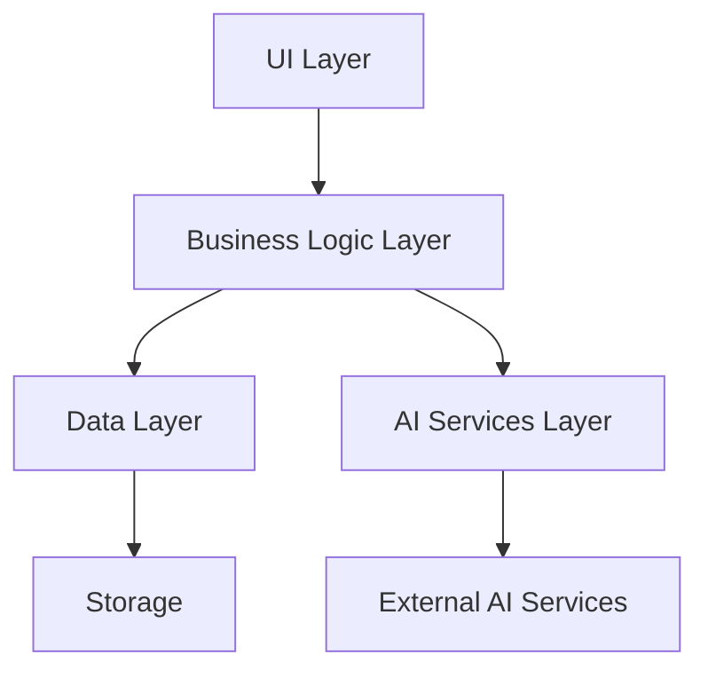
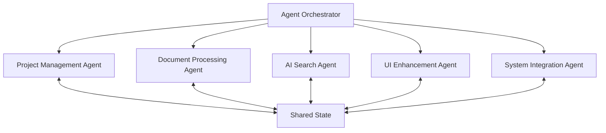
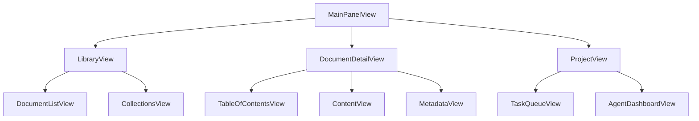
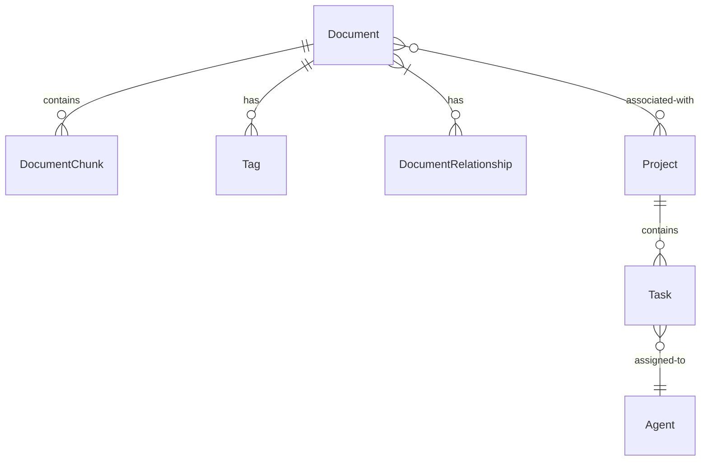

# Design Document

## Overview

DocShop is designed as a modular, extensible macOS application for managing technical documentation. The system follows a multi-agent architecture where specialized components work together to process, organize, and enhance documentation from various sources. This design document outlines the architecture, components, interfaces, data models, and other key aspects of the system.

The application is built with Swift and SwiftUI for the frontend, with a modular backend that separates concerns and allows for independent development and testing of components. The system is designed to be future-proof, with well-defined integration points and extensible data models.

## Architecture

### High-Level Architecture

DocShop follows a layered architecture with clear separation of concerns:



### Multi-Agent Architecture

The system implements a multi-agent architecture where specialized agents handle different aspects of document processing and management:



### Module Structure

The application is organized into the following modules:

1. **App Module**: Main application entry point and UI coordination
2. **Core Module**: Core business logic and document processing
3. **Data Module**: Data persistence and retrieval
4. **Models Module**: Shared data models and types
5. **Views Module**: UI components and screens
6. **API Module**: External API integrations and services

## Components and Interfaces

### UI Components

The UI layer consists of SwiftUI views organized in a hierarchical structure:



#### Key UI Components:

1. **MainPanelView**: Main application window with navigation
2. **LibraryView**: Document library and collection management
3. **DocumentDetailView**: Document viewing and interaction
4. **ProjectView**: Project management and orchestration
5. **AgentDashboardView**: Agent status and control panel

### Core Components

The core business logic is organized into specialized components:

1. **DocumentProcessor**: Handles document ingestion and processing
   - Interface: `DocumentProcessing`
   - Implementation: `SmartDocumentProcessor`

2. **DocumentSearchIndex**: Manages document indexing and search
   - Interface: `SearchIndexing`
   - Implementation: `DocumentSearchIndex`

3. **AgentOrchestrator**: Coordinates multi-agent activities
   - Interface: `AgentOrchestration`
   - Implementation: `AgentOrchestrator`

4. **AIDocumentAnalyzer**: AI-powered document analysis
   - Interface: `DocumentAnalysis`
   - Implementation: `AIDocumentAnalyzer`

5. **ContextManager**: Manages document context and relationships
   - Interface: `ContextManagement`
   - Implementation: `ContextManager`

### Agent Communication

Agents communicate through well-defined interfaces:

```swift
protocol AgentCommunication {
    func sendMessage(_ message: AgentMessage) async throws
    func receiveMessage(_ message: AgentMessage) async throws
    func requestData(_ request: DataRequest) async throws -> DataResponse
}
```

### Shared State Management

Agents share state through a centralized manager:

```swift
protocol SharedStateManager {
    func updateState<T>(_ key: StateKey, value: T) async throws
    func getState<T>(_ key: StateKey, type: T.Type) async throws -> T?
    func subscribeToChanges(_ key: StateKey, handler: @escaping (Any) -> Void)
}
```

## Data Models

### Core Data Models

1. **IngestedDocument**
   - Represents a processed document in the system
   - Contains metadata, content, and relationships

```swift
struct IngestedDocument: Identifiable, Codable {
    var id: UUID
    var title: String
    var content: String
    var metadata: DocumentMetadata
    var chunks: [DocumentChunk]
    var relationships: [DocumentRelationship]
    var tags: [String]
    var dateAdded: Date
    var dateModified: Date
    var version: Int
}
```

2. **DocumentMetadata**
   - Contains metadata about a document

```swift
struct DocumentMetadata: Codable {
    var source: DocumentSource
    var author: String?
    var dateCreated: Date?
    var datePublished: Date?
    var language: String?
    var programmingLanguages: [String]?
    var frameworks: [String]?
    var companies: [String]?
    var contentType: ContentType
    var fileSize: Int?
    var pageCount: Int?
    var wordCount: Int?
    var readingTime: TimeInterval?
}
```

3. **Project**
   - Represents a project with associated documents

```swift
struct Project: Identifiable, Codable {
    var id: UUID
    var name: String
    var description: String
    var documentIds: [UUID]
    var tasks: [Task]
    var dateCreated: Date
    var dateModified: Date
}
```

4. **AgentContextTypes**
   - Defines context for agent operations

```swift
struct AgentContext {
    var documentId: UUID?
    var projectId: UUID?
    var taskId: UUID?
    var parameters: [String: Any]
    var priority: TaskPriority
}
```

### Data Relationships

Documents and projects are related through a flexible relationship model:



## Error Handling

The system implements a comprehensive error handling strategy:

1. **Domain-Specific Errors**
   - Each module defines its own error types
   - Errors include context and recovery suggestions

```swift
enum DocumentProcessingError: Error {
    case importFailed(reason: String)
    case parsingFailed(reason: String)
    case invalidFormat(format: String)
    case processingTimeout(after: TimeInterval)
    
    var recoveryOptions: [RecoveryOption] { ... }
}
```

2. **Error Propagation**
   - Errors are propagated up the call stack
   - UI displays appropriate error messages
   - Logging captures error details for troubleshooting

3. **Graceful Degradation**
   - System continues functioning when non-critical components fail
   - Alternative paths are provided when primary functions are unavailable

## Testing Strategy

### Unit Testing

- Each component has comprehensive unit tests
- Mock implementations of dependencies for isolated testing
- Test coverage targets of >80% for core components

### Integration Testing

- Tests for component interactions
- End-to-end tests for critical user flows
- Performance tests for search and document processing

### UI Testing

- Automated UI tests for key user journeys
- Accessibility testing
- Cross-device testing for different screen sizes

## Security Considerations

1. **Data Protection**
   - Local-first processing when possible
   - Encryption for sensitive document content
   - Secure storage of API keys in Keychain

2. **API Security**
   - Secure API key management
   - Rate limiting for external API calls
   - Validation of all external data

3. **Privacy Controls**
   - User control over data sharing
   - Clear indication of AI-processed content
   - Compliance with data protection regulations

## Performance Considerations

1. **Document Processing**
   - Background processing for large documents
   - Progress tracking for long-running operations
   - Chunking of large documents for efficient processing

2. **Search Performance**
   - Optimized indexing for fast search
   - Incremental indexing for large document libraries
   - Caching of frequent search results

3. **UI Responsiveness**
   - Asynchronous loading of content
   - Pagination for large document lists
   - Lazy loading of document content

## Extensibility

The system is designed for extensibility in several key areas:

1. **Document Formats**
   - Pluggable parser architecture for new formats
   - Format-specific metadata extraction
   - Custom rendering options for different formats

2. **AI Capabilities**
   - Modular AI service integration
   - Pluggable AI models for different tasks
   - Local and remote AI processing options

3. **UI Customization**
   - Theming support
   - Customizable layouts
   - Extensible keyboard shortcuts

## Deployment and Distribution

1. **macOS App Store**
   - Compliance with App Store guidelines
   - Sandboxing for security
   - In-app purchases for premium features

2. **Direct Distribution**
   - Notarization for security
   - Auto-update mechanism
   - License management

## Future Considerations

1. **Cloud Sync**
   - Secure document synchronization across devices
   - Conflict resolution for concurrent edits
   - Selective sync for large libraries

2. **Collaboration Features**
   - Real-time collaboration on documents
   - Shared collections and annotations
   - Team-based access controls

3. **Mobile Companion App**
   - iOS companion app for document viewing
   - Synchronized library across devices
   - Mobile-optimized UI

4. **Enterprise Features**
   - SSO integration
   - Advanced compliance features
   - Custom deployment options